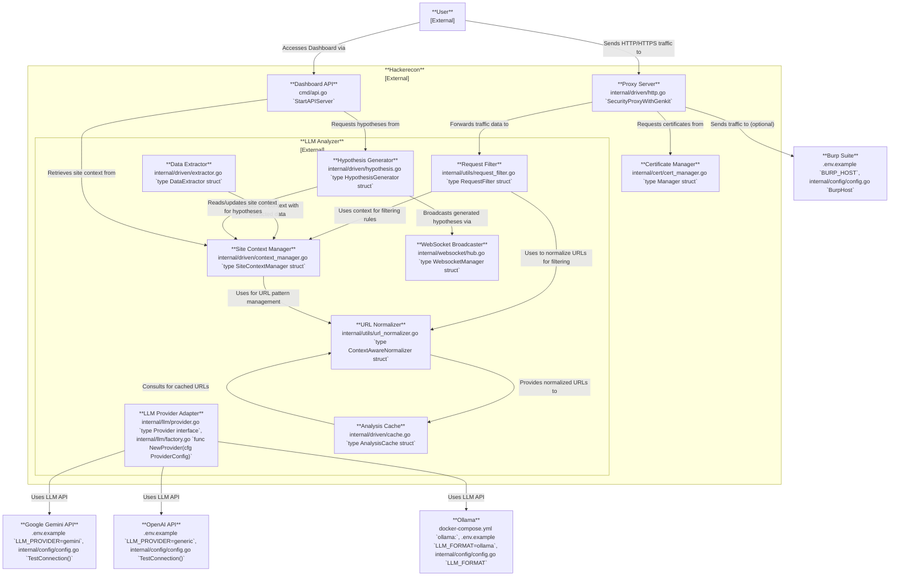

# Unnamed CodeViz Diagram

```mermaid
graph TD

    base.cv::user["**User**<br>[External]"]
    base.cv::googleGemini["**Google Gemini API**<br>.env.example `LLM_PROVIDER=gemini`, internal/config/config.go `TestConnection()`"]
    base.cv::openAIApi["**OpenAI API**<br>.env.example `LLM_PROVIDER=generic`, internal/config/config.go `TestConnection()`"]
    base.cv::burpSuite["**Burp Suite**<br>.env.example `BURP_HOST`, internal/config/config.go `BurpHost`"]
    base.cv::ollama["**Ollama**<br>docker-compose.yml `ollama:`, .env.example `LLM_FORMAT=ollama`, internal/config/config.go `LLM_FORMAT`"]
    subgraph base.cv::hackerecon["**Hackerecon**<br>[External]"]
        base.cv::proxy["**Proxy Server**<br>internal/driven/http.go `SecurityProxyWithGenkit`"]
        base.cv::dashboardApi["**Dashboard API**<br>cmd/api.go `StartAPIServer`"]
        base.cv::certManager["**Certificate Manager**<br>internal/cert/cert_manager.go `type Manager struct`"]
        subgraph base.cv::llmAnalyzer["**LLM Analyzer**<br>[External]"]
            base.cv::llmAnalyzer_providerAdapter["**LLM Provider Adapter**<br>internal/llm/provider.go `type Provider interface`, internal/llm/factory.go `func NewProvider(cfg ProviderConfig)`"]
            base.cv::llmAnalyzer_analysisCache["**Analysis Cache**<br>internal/driven/cache.go `type AnalysisCache struct`"]
            base.cv::llmAnalyzer_siteContextManager["**Site Context Manager**<br>internal/driven/context_manager.go `type SiteContextManager struct`"]
            base.cv::llmAnalyzer_dataExtractor["**Data Extractor**<br>internal/driven/extractor.go `type DataExtractor struct`"]
            base.cv::llmAnalyzer_hypothesisGenerator["**Hypothesis Generator**<br>internal/driven/hypothesis.go `type HypothesisGenerator struct`"]
            base.cv::llmAnalyzer_urlNormalizer["**URL Normalizer**<br>internal/utils/url_normalizer.go `type ContextAwareNormalizer struct`"]
            base.cv::llmAnalyzer_requestFilter["**Request Filter**<br>internal/utils/request_filter.go `type RequestFilter struct`"]
            base.cv::llmAnalyzer_wsBroadcaster["**WebSocket Broadcaster**<br>internal/websocket/hub.go `type WebsocketManager struct`"]
            %% Edges at this level (grouped by source)
            base.cv::llmAnalyzer_requestFilter["**Request Filter**<br>internal/utils/request_filter.go `type RequestFilter struct`"] -->|"Uses to normalize URLs for filtering"| base.cv::llmAnalyzer_urlNormalizer["**URL Normalizer**<br>internal/utils/url_normalizer.go `type ContextAwareNormalizer struct`"]
            base.cv::llmAnalyzer_requestFilter["**Request Filter**<br>internal/utils/request_filter.go `type RequestFilter struct`"] -->|"Uses context for filtering rules"| base.cv::llmAnalyzer_siteContextManager["**Site Context Manager**<br>internal/driven/context_manager.go `type SiteContextManager struct`"]
            base.cv::llmAnalyzer_urlNormalizer["**URL Normalizer**<br>internal/utils/url_normalizer.go `type ContextAwareNormalizer struct`"] -->|"Provides normalized URLs to"| base.cv::llmAnalyzer_analysisCache["**Analysis Cache**<br>internal/driven/cache.go `type AnalysisCache struct`"]
            base.cv::llmAnalyzer_analysisCache["**Analysis Cache**<br>internal/driven/cache.go `type AnalysisCache struct`"] -->|"Consults for cached URLs"| base.cv::llmAnalyzer_urlNormalizer["**URL Normalizer**<br>internal/utils/url_normalizer.go `type ContextAwareNormalizer struct`"]
            base.cv::llmAnalyzer_siteContextManager["**Site Context Manager**<br>internal/driven/context_manager.go `type SiteContextManager struct`"] -->|"Uses for URL pattern management"| base.cv::llmAnalyzer_urlNormalizer["**URL Normalizer**<br>internal/utils/url_normalizer.go `type ContextAwareNormalizer struct`"]
            base.cv::llmAnalyzer_dataExtractor["**Data Extractor**<br>internal/driven/extractor.go `type DataExtractor struct`"] -->|"Updates site context with extracted data"| base.cv::llmAnalyzer_siteContextManager["**Site Context Manager**<br>internal/driven/context_manager.go `type SiteContextManager struct`"]
            base.cv::llmAnalyzer_hypothesisGenerator["**Hypothesis Generator**<br>internal/driven/hypothesis.go `type HypothesisGenerator struct`"] -->|"Reads/updates site context for hypotheses"| base.cv::llmAnalyzer_siteContextManager["**Site Context Manager**<br>internal/driven/context_manager.go `type SiteContextManager struct`"]
            base.cv::llmAnalyzer_hypothesisGenerator["**Hypothesis Generator**<br>internal/driven/hypothesis.go `type HypothesisGenerator struct`"] -->|"Broadcasts generated hypotheses via"| base.cv::llmAnalyzer_wsBroadcaster["**WebSocket Broadcaster**<br>internal/websocket/hub.go `type WebsocketManager struct`"]
        end
        %% Edges at this level (grouped by source)
        base.cv::proxy["**Proxy Server**<br>internal/driven/http.go `SecurityProxyWithGenkit`"] -->|"Forwards traffic data to"| base.cv::llmAnalyzer_requestFilter["**Request Filter**<br>internal/utils/request_filter.go `type RequestFilter struct`"]
        base.cv::proxy["**Proxy Server**<br>internal/driven/http.go `SecurityProxyWithGenkit`"] -->|"Requests certificates from"| base.cv::certManager["**Certificate Manager**<br>internal/cert/cert_manager.go `type Manager struct`"]
        base.cv::dashboardApi["**Dashboard API**<br>cmd/api.go `StartAPIServer`"] -->|"Requests hypotheses from"| base.cv::llmAnalyzer_hypothesisGenerator["**Hypothesis Generator**<br>internal/driven/hypothesis.go `type HypothesisGenerator struct`"]
        base.cv::dashboardApi["**Dashboard API**<br>cmd/api.go `StartAPIServer`"] -->|"Retrieves site context from"| base.cv::llmAnalyzer_siteContextManager["**Site Context Manager**<br>internal/driven/context_manager.go `type SiteContextManager struct`"]
    end
    %% Edges at this level (grouped by source)
    base.cv::user["**User**<br>[External]"] -->|"Sends HTTP/HTTPS traffic to"| base.cv::proxy["**Proxy Server**<br>internal/driven/http.go `SecurityProxyWithGenkit`"]
    base.cv::user["**User**<br>[External]"] -->|"Accesses Dashboard via"| base.cv::dashboardApi["**Dashboard API**<br>cmd/api.go `StartAPIServer`"]
    base.cv::llmAnalyzer_providerAdapter["**LLM Provider Adapter**<br>internal/llm/provider.go `type Provider interface`, internal/llm/factory.go `func NewProvider(cfg ProviderConfig)`"] -->|"Uses LLM API"| base.cv::googleGemini["**Google Gemini API**<br>.env.example `LLM_PROVIDER=gemini`, internal/config/config.go `TestConnection()`"]
    base.cv::llmAnalyzer_providerAdapter["**LLM Provider Adapter**<br>internal/llm/provider.go `type Provider interface`, internal/llm/factory.go `func NewProvider(cfg ProviderConfig)`"] -->|"Uses LLM API"| base.cv::openAIApi["**OpenAI API**<br>.env.example `LLM_PROVIDER=generic`, internal/config/config.go `TestConnection()`"]
    base.cv::llmAnalyzer_providerAdapter["**LLM Provider Adapter**<br>internal/llm/provider.go `type Provider interface`, internal/llm/factory.go `func NewProvider(cfg ProviderConfig)`"] -->|"Uses LLM API"| base.cv::ollama["**Ollama**<br>docker-compose.yml `ollama:`, .env.example `LLM_FORMAT=ollama`, internal/config/config.go `LLM_FORMAT`"]
    base.cv::proxy["**Proxy Server**<br>internal/driven/http.go `SecurityProxyWithGenkit`"] -->|"Sends traffic to (optional)"| base.cv::burpSuite["**Burp Suite**<br>.env.example `BURP_HOST`, internal/config/config.go `BurpHost`"]

```
---
*Generated by [CodeViz.ai](https://codeviz.ai) on 07.12.2025, 22:35:53*
