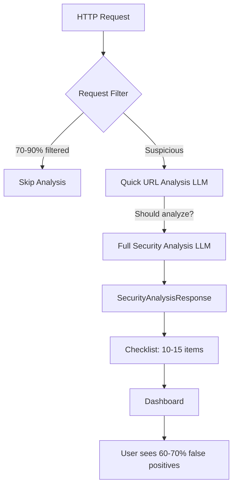
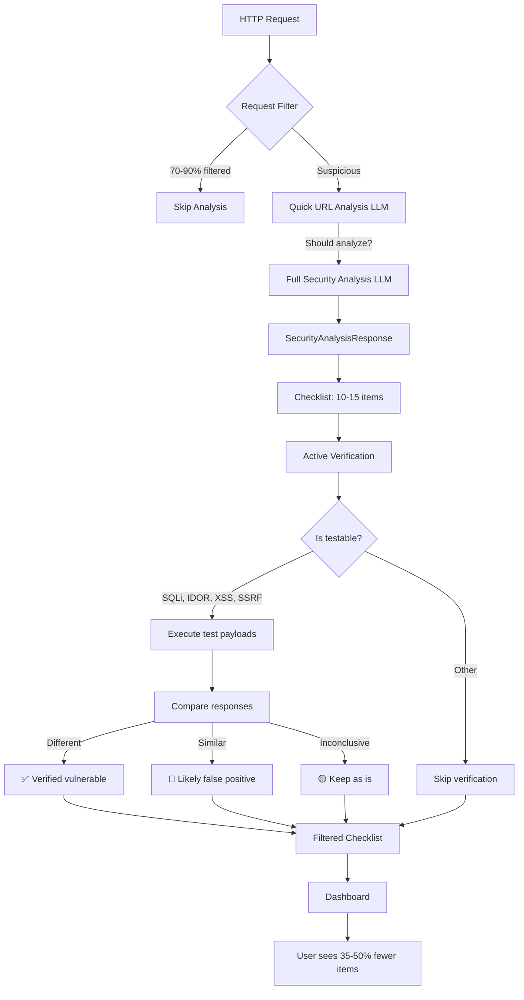
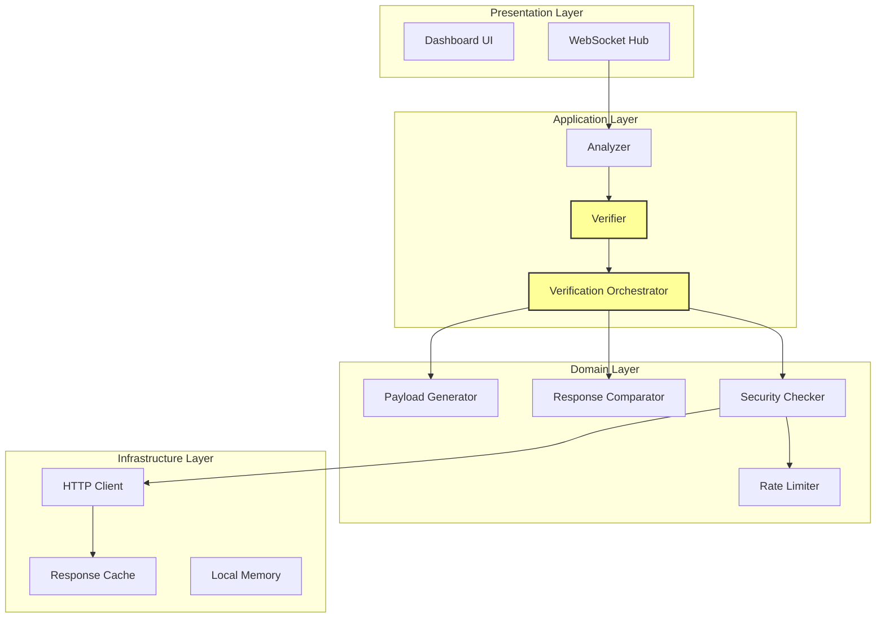
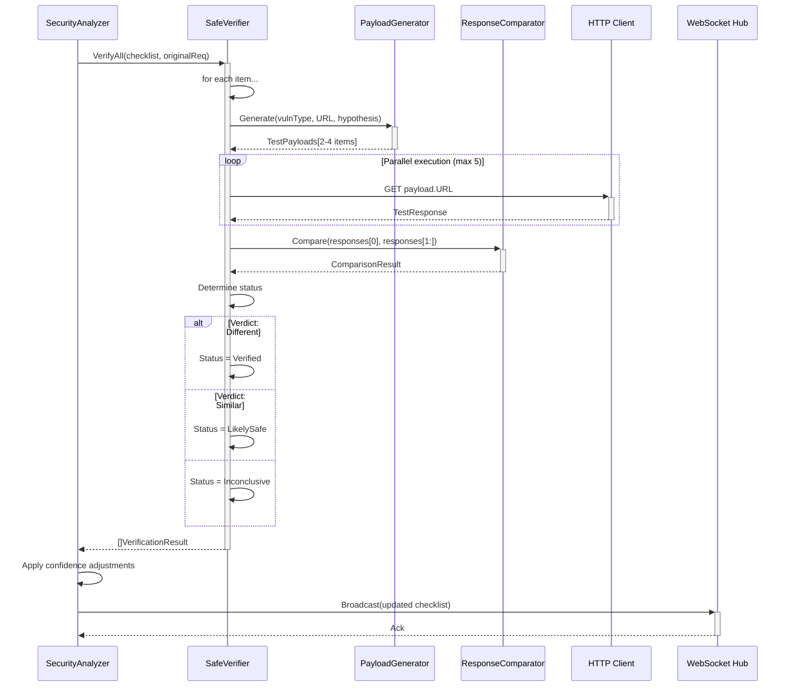
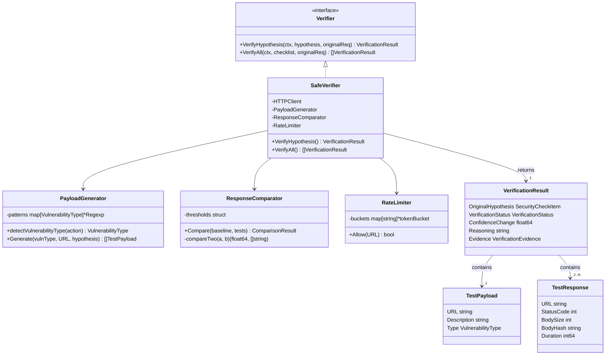
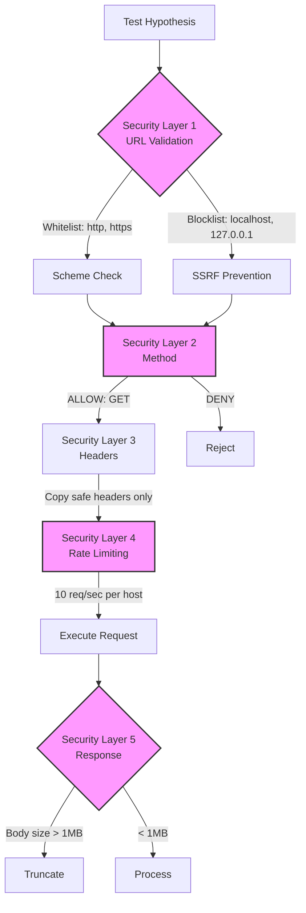
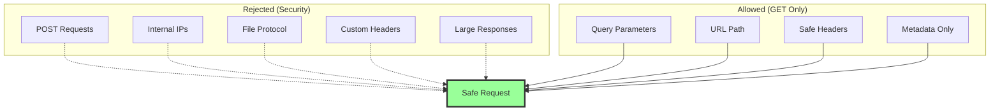
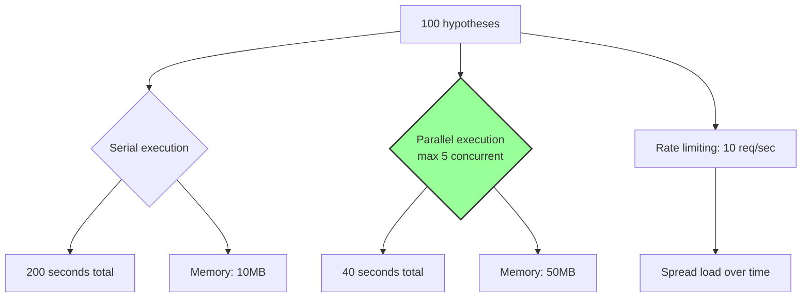
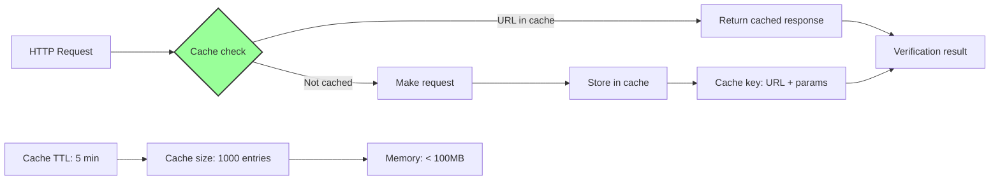

# Active Verification: Architecture Diagrams

## 1. Data Flow Diagram

### Current Flow (Без Verification)

```mermaid
graph TD
    A[HTTP Request] --> B{Request Filter}
    B -->|70-90% filtered| C[Skip Analysis]
    B -->|Suspicious| D[Quick URL Analysis LLM]
    D -->|Should analyze?| E[Full Security Analysis LLM]
    E --> F[SecurityAnalysisResponse]
    F --> G[Checklist: 10-15 items]
    G --> H[Dashboard]
    H --> I[User sees 60-70% false positives]
```

### New Flow (С Verification)

```mermaid
graph TD
    A[HTTP Request] --> B{Request Filter}
    B -->|70-90% filtered| C[Skip Analysis]
    B -->|Suspicious| D[Quick URL Analysis LLM]
    D -->|Should analyze?| E[Full Security Analysis LLM]
    E --> F[SecurityAnalysisResponse]
    F --> G[Checklist: 10-15 items]

    G --> H[Active Verification]
    H --> I{Is testable?}
    I -->|SQLi, IDOR, XSS, SSRF| J[Execute test payloads]
    I -->|Other| K[Skip verification]

    J --> L[Compare responses]
    L -->|Different| M[✅ Verified vulnerable]
    L -->|Similar| N[🔴 Likely false positive]
    L -->|Inconclusive| O[🟡 Keep as is]

    M --> P[Filtered Checklist]
    N --> P
    O --> P
    K --> P

    P --> Q[Dashboard]
    Q --> R[User sees 35-50% fewer items]
```

## 2. Component Architecture

### Layered Architecture

```mermaid
graph TB
    subgraph "Presentation Layer"
        Dashboard[Dashboard UI]
        WSHub[WebSocket Hub]
    end

    subgraph "Application Layer"
        Analyzer[Analyzer]
        Verifier[Verifier]
        Orchestrator[Verification Orchestrator]
    end

    subgraph "Domain Layer"
        PG[Payload Generator]
        RC[Response Comparator]
        RL[Rate Limiter]
        SC[Security Checker]
    end

    subgraph "Infrastructure Layer"
        HTTP[HTTP Client]
        Cache[Response Cache]
        LM[Local Memory]
    end

    WSHub --> Analyzer
    Analyzer --> Verifier
    Verifier --> Orchestrator
    Orchestrator --> PG
    Orchestrator --> RC
    Orchestrator --> SC
    SC --> RL
    SC --> HTTP
    HTTP --> Cache

    style Verifier fill:#ff9,stroke:#333,stroke-width:2px
    style Orchestrator fill:#ff9,stroke:#333,stroke-width:2px
```

### Component Responsibilities

```mermaid
graph LR
    subgraph "Before (LLM Only)"
        LLM[LLM Analysis]
        LLM --> Response[SecurityAnalysisResponse]
        Response --> Items[10-15 Checklist Items]
    end

    subgraph "After (+ Verification)"
        Items --> Verifier[Verifier]
        Verifier --> PG[Generate Payloads]
        PG --> HTTP[HTTP Client]
        HTTP --> Comp[Compare Responses]
        Comp --> Filtered[Filtered Items]
        Filtered --> Result[7-10 Items (35% less)]
    end

    style Verifier fill:#ff9,stroke:#333,stroke-width:2px
```

## 3. Verification Flow Detail

### Step-by-Step Flow

```mermaid
sequenceDiagram
    participant Analyzer as SecurityAnalyzer
    participant Verifier as SafeVerifier
    participant PG as PayloadGenerator
    participant RC as ResponseComparator
    participant HTTP as HTTP Client
    participant WS as WebSocket Hub

    Analyzer->>+Verifier: VerifyAll(checklist, originalReq)
    Verifier->>Verifier: for each item...

    Verifier->>+PG: Generate(vulnType, URL, hypothesis)
    PG-->>-Verifier: TestPayloads[2-4 items]

    loop Parallel execution (max 5)
        Verifier->>+HTTP: GET payload.URL
        HTTP-->>-Verifier: TestResponse
    end

    Verifier->>+RC: Compare(responses[0], responses[1:])
    RC-->>-Verifier: ComparisonResult

    Verifier->>Verifier: Determine status
    alt Verdict: Different
        Verifier->>Verifier: Status = Verified
    else Verdict: Similar
        Verifier->>Verifier: Status = LikelySafe
    else
        Verifier->>Verifier: Status = Inconclusive
    end

    Verifier-->>-Analyzer: []VerificationResult

    Analyzer->>Analyzer: Apply confidence adjustments
    Analyzer->>+WS: Broadcast(updated checklist)
    WS-->>-Analyzer: Ack
```

### Class Diagram

```mermaid
classDiagram
    class Verifier {
        <<interface>>
        +VerifyHypothesis(ctx, hypothesis, originalReq) VerificationResult
        +VerifyAll(ctx, checklist, originalReq) []VerificationResult
    }

    class SafeVerifier {
        -HTTPClient
        -PayloadGenerator
        -ResponseComparator
        -RateLimiter
        +VerifyHypothesis() VerificationResult
        +VerifyAll() []VerificationResult
    }

    class PayloadGenerator {
        -patterns map[VulnerabilityType]*Regexp
        +detectVulnerabilityType(action) VulnerabilityType
        +Generate(vulnType, URL, hypothesis) []TestPayload
    }

    class ResponseComparator {
        -thresholds struct
        +Compare(baseline, tests) ComparisonResult
        -compareTwo(a, b) (float64, []string)
    }

    class RateLimiter {
        -buckets map[string]*tokenBucket
        +Allow(URL) bool
    }

    class VerificationResult {
        OriginalHypothesis SecurityCheckItem
        VerificationStatus VerificationStatus
        ConfidenceChange float64
        Reasoning string
        Evidence VerificationEvidence
    }

    class TestPayload {
        URL string
        Description string
        Type VulnerabilityType
    }

    class TestResponse {
        URL string
        StatusCode int
        BodySize int
        BodyHash string
        Duration int64
    }

    Verifier <|.. SafeVerifier
    SafeVerifier --> PayloadGenerator
    SafeVerifier --> ResponseComparator
    SafeVerifier --> RateLimiter
    SafeVerifier --> "1" VerificationResult: returns
    VerificationResult --> "1" TestPayload: contains
    VerificationResult --> "2..N" TestResponse: contains
```

## 4. Security Architecture

### Security Layers

```mermaid
graph TD
    A[Test Hypothesis] --> B{Security Layer 1<br/>URL Validation}
    B -->|Whitelist: http, https| C[Scheme Check]
    B -->|Blocklist: localhost, 127.0.0.1| D[SSRF Prevention]
    C --> E[Security Layer 2<br/>Method]
    D --> E

    E -->|ALLOW: GET| F[Security Layer 3<br/>Headers]
    E -->|DENY| G[Reject]

    F -->|Copy safe headers only| H[Security Layer 4<br/>Rate Limiting]
    H -->|10 req/sec per host| I[Execute Request]

    I --> J{Security Layer 5<br/>Response}
    J -->|Body size > 1MB| K[Truncate]
    J -->|< 1MB| L[Process]

    style B fill:#f9f,stroke:#333,stroke-width:2px
    style E fill:#f9f,stroke:#333,stroke-width:2px
    style H fill:#f9f,stroke:#333,stroke-width:2px
    style J fill:#f9f,stroke:#333,stroke-width:2px
```

### Attack Surface Minimization

```mermaid
graph TB
    subgraph "Rejected (Security)"
        POST[POST Requests]
        Internal[Internal IPs]
        File[File Protocol]
        Custom[Custom Headers]
        Large[Large Responses]
    end

    subgraph "Allowed (GET Only)"
        Query[Query Parameters]
        Path[URL Path]
        Safe[Safe Headers]
        Meta[Metadata Only]
    end

    Result[Safe Request]

    POST -.-> Result
    Internal -.-> Result
    File -.-> Result
    Custom -.-> Result
    Large -.-> Result

    Query --> Result
    Path --> Result
    Safe --> Result
    Meta --> Result

    style Result fill:#9f9,stroke:#333,stroke-width:3px
```

## 5. State Management

### Request Flow States

```mermaid
stateDiagram-v2
    direction LR

    [*] --> AnalysisStarted: HTTP request captured
    AnalysisStarted --> QuickAnalysis: Quick LLM analysis
    QuickAnalysis --> FullAnalysis: LLM decides to analyze
    FullAnalysis --> ChecklistGenerated: SecurityAnalysisResponse

    ChecklistGenerated --> VerificationStarted: Launch verification goroutine
    VerificationStarted --> PayloadsGenerated: For testable items
    PayloadsGenerated --> HTTPRequests: Execute tests

    state HTTPRequests {
        [*] --> Request1: Parallel execution
        [*] --> Request2
        [*] --> Request3

        Request1 --> Responses: Response received
        Request2 --> Responses
        Request3 --> Responses
    }

    HTTPRequests --> Comparison: Compare responses
    Comparison --> Verified: Different responses → vulnerable
    Comparison --> FalsePositive: Similar responses → safe
    Comparison --> Inconclusive: Cannot determine

    Verified --> Broadcast: Send updated checklist
    FalsePositive --> Broadcast
    Inconclusive --> Broadcast

    Broadcast --> [*]

    state VerificationStarted {
        [*] --> Untestable: Other vulnerability types
        Untestable --> [*]
    }

    Note right of VerificationStarted: Non-testable
    Note right of VerificationStarted: items skipped

    style Verified fill:#9f9
    style FalsePositive fill:#f99
    style Inconclusive fill:#ff9
```

## 6. Performance & Scalability

### Resource Flow

```mermaid
graph TD
    A[100 hypotheses] --> B{Serial execution}
    B --> C[200 seconds total]
    B --> D[Memory: 10MB]

    A --> E{Parallel execution<br/>max 5 concurrent}
    E --> F[40 seconds total]
    E --> G[Memory: 50MB]

    A --> H[Rate limiting: 10 req/sec]
    H --> I[Spread load over time]

    style E fill:#9f9,stroke:#333,stroke-width:2px
```

### Caching Strategy

```mermaid
graph LR
    A[HTTP Request] --> B{Cache check}
    B -->|URL in cache| C[Return cached response]
    B -->|Not cached| D[Make request]

    D --> E[Store in cache]
    E --> F[Cache key: URL + params]
    C --> G[Verification result]
    F --> G

    H[Cache TTL: 5 min] --> I[Cache size: 1000 entries]
    I --> J[Memory: < 100MB]

    style B fill:#9f9,stroke:#333,stroke-width:2px
```

## 7. Error Handling

### Failure Modes

```mermaid
graph TD
    Request[HTTP Request] --> Exec{Execution}

    Exec -->|Network error| Retry[Retry (max 3)]
    Exec -->|Timeout| TimeoutLog[Log, mark inconclusive]
    Exec -->|HTTP error| Mark[Mark as inconclusive]

    Retry -->|Success| Analyze[Analyze response]
    Retry -->|Fail 3x| Fail[Give up, inconclusive]

    Analyze -->|Invalid response| Invalid[Log, inconclusive]
    Analyze -->|Valid response| Compare[Compare with baseline]

    Mark --> ResultInconclusive
    TimeoutLog --> ResultInconclusive
    Fail --> ResultInconclusive
    Invalid --> ResultInconclusive

    Compare --> Diff{Different?}
    Diff -->|Yes| ResultConfirmed[Vulnerable]
    Diff -->|No| ResultSafe[Safe]
    Diff -->|Unclear| ResultInconclusive[Inconclusive]

    style Exec fill:#f9f,stroke:#333,stroke-width:2px
    style Compare fill:#f9f,stroke:#333,stroke-width:2px
    style Diff fill:#ff9,stroke:#333,stroke-width:2px
```

## 8. Deployment Architecture

### Component Interaction

```mermaid
graph TB
    subgraph "Process 1: Proxy"
        Proxy[HTTP Proxy]
        Proxy --> Analyzer[SecurityAnalyzer]
    end

    subgraph "Process 2: Verifier (Goroutine)"
        Analyzer --> Verify[VerifyAll async]
        Verify --> PG[PayloadGenerator]
        Verify --> RC[ResponseComparator]
    end

    subgraph "Process 3: Dashboard"
        WSServer[WebSocket Server]
        WSServer --> DashboardUI[Dashboard UI]
        DashboardUI --> Display[Show verified results]
    end

    Analyzer --> WSServer: Broadcast initial results
    Verify --> WSServer: Broadcast updates

    subgraph "External Services"
        Target[Target Application]
        HTTP --> Target: Test requests
    end

    PG --> HTTP[HTTP Client]
    HTTP --> Target
    Target --> HTTP: Responses
    HTTP --> RC

    style Verify fill:#ff9,stroke:#333,stroke-width:2px
```

## 9. Summary

### Key Architecture Decisions

1. **Async verification** — не блокирует основной поток анализа
2. **Parallel execution** — 5 concurrent for speed, rate-limited for safety
3. **Rule-based payloads** — predictability over flexibility
4. **Multi-layer security** — validate at every step
5. **Stateless design** — easy to test, deploy, scale

### Component Boundaries

- **Verifier**: Orchestration, lifecycle management
- **PayloadGenerator**: Domain logic (what to test)
- **ResponseComparator**: Analysis logic (what it means)
- **RateLimiter**: Infrastructure (how fast)
- **SecurityChecker**: Safety (what's allowed)

Эти компоненты можно тестировать, развертывать и масштабировать независимо.
